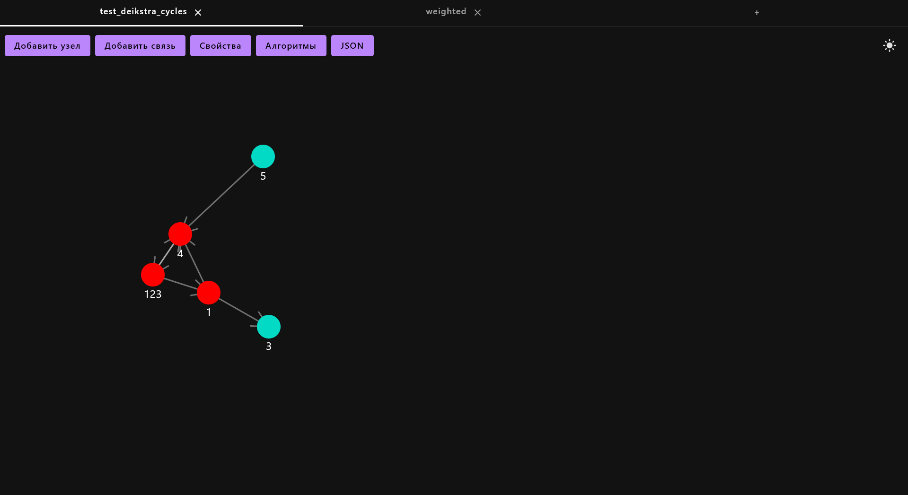
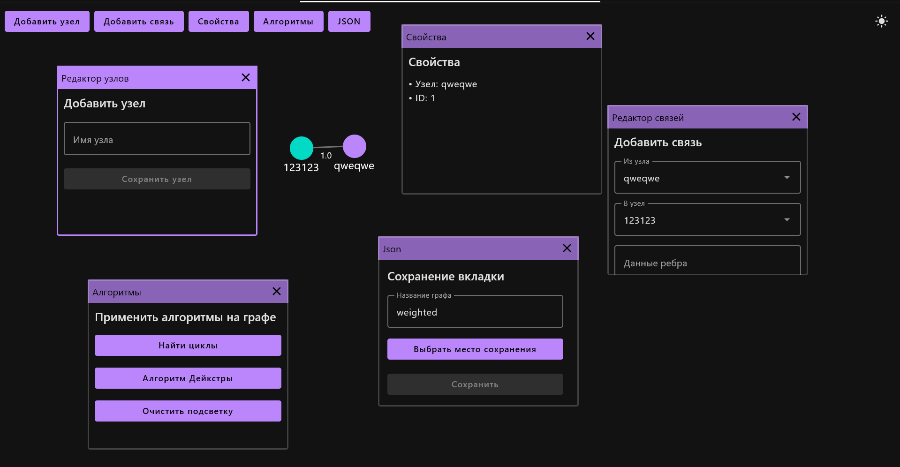
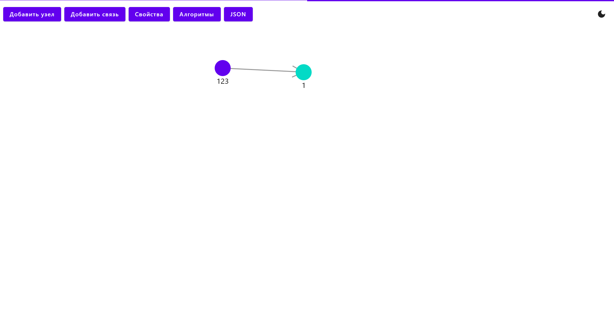
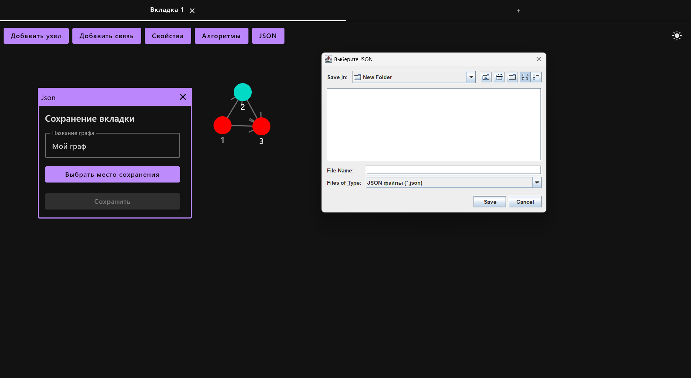

<p align="center"> </p>
<h1 align="center">Boyaan</h1>
<p align="center">GUI software for graphs</p>

<hr>


## ☋ Supported Properties

* Directed
* Weighted

## 🧮 Algorithms

* <b>Layout algorithm</b> - Force Atlas 2 - by default in your graph tab - Oderiy Yaroslav
* <b>Cycles find</b> - DFS - click on vertex and choose in algorithms tab - Oderiy Yaroslav
* <b>Dijkstra algorithm</b> - Edsger Wybe Dijkstra - click on vertex and choose in algorithms tab - Oderiy Yaroslav
* <b>Community detection</b> - Louvain - click on vertex and choose in algorithms tab - Kharisov Bogdan
* <b>Minimum spanning tree detection</b> - Kosaraju - click on vertex and choose in algorithms tab - Kharisov Bogdan
* <b>Strongly connected communities detection</b> - Kruskal -  click on vertex and choose in algorithms tab - Kharisov Bogdan
* <b>Bridges Find</b> - DFS - not in GUI - Tarasov Andrei
* <b>Ford Bellman</b> - R. Bellman L. Ford - not in GUI - Tarasov Andrei


## 🛠️ Quick Start
Download project from github and start command from project root
```bash
./gradlew run
```


## 💡Features
* <b>Tab system</b> - work with graphs in different tabs. Your state will be automatic safe.
<p align="start"> </p>

* <b>Window system</b> - all work with graph is in floating windows.
<p align="start"> </p>

* <b>Theme switch</b> - you can easy switch theme on light and dark.
<p align="start"> </p>

## ⚙️ Save/Load
You can save and load your graph with JSON files
<p align="start"> </p>


## 👨‍💻 Authors

* [Kharisov Bogdan](https://github.com/lospollosenjoyer)
* [Oderiy Yaroslav](https://github.com/XRenso)
* [Tarasov Andrei](https://github.com/TheFollan)

## 🪪 License
This project is licensed under the [<b>MIT</b>](LICENSE).
